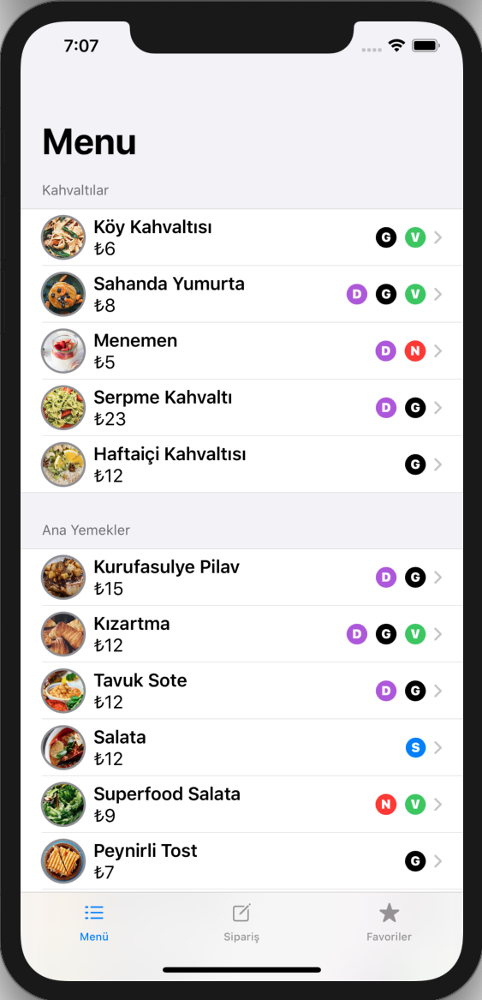
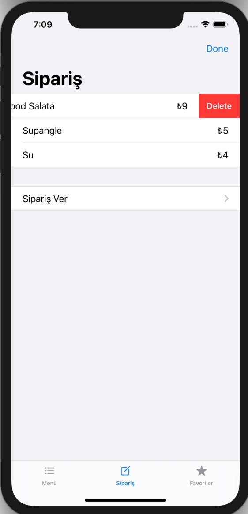
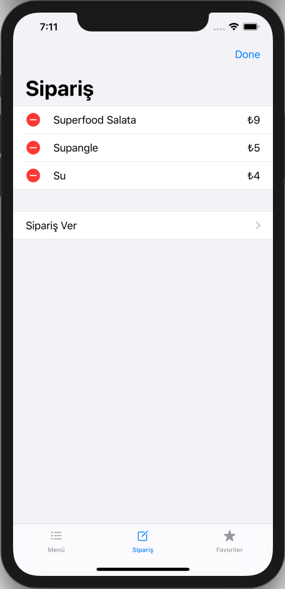
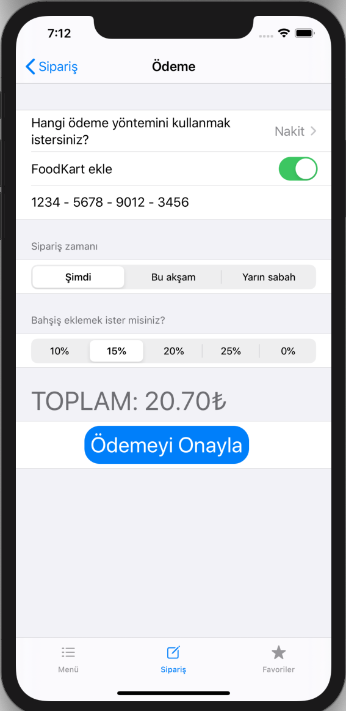
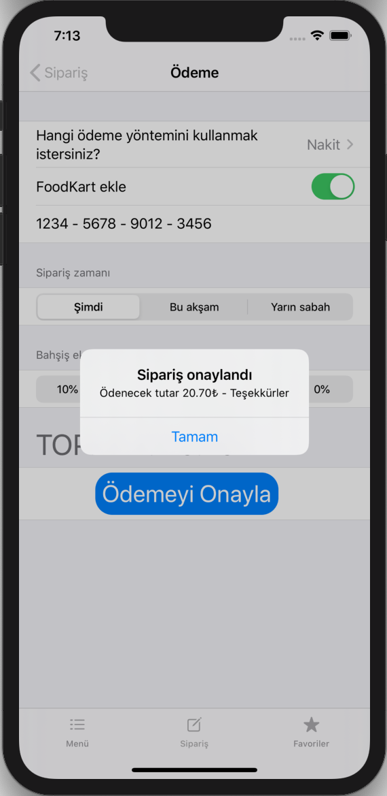
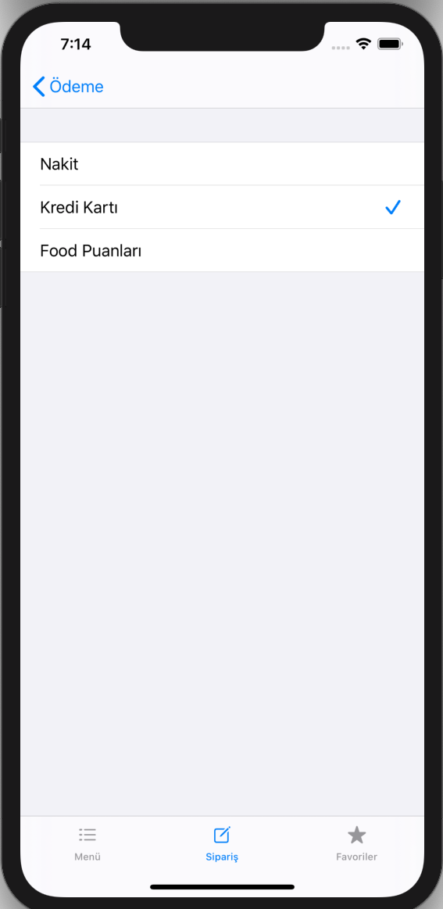
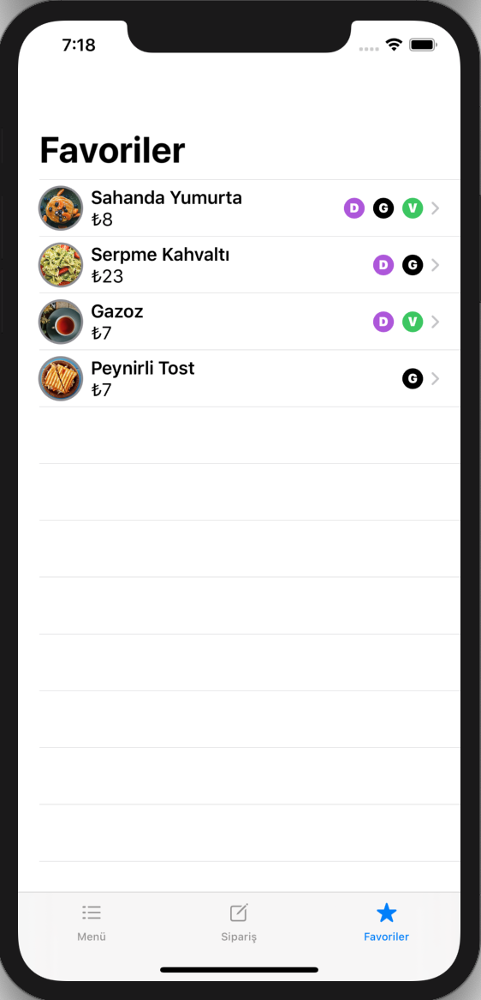

# FOOD DELIVERY APP  

---
This project is my very first SwiftUI project and I followed <a href = "https://twitter.com/twostraws">Paul Hudson</a>'s <a href = "https://www.youtube.com/watch?v=nc-n5Gc8wN0&list=PLuoeXyslFTubw4NtepDCis5tTqK37zT3Q">tutorial</a>. 
---

  &nbsp; 
  &nbsp;
  &nbsp;
  &nbsp;
     

  &nbsp;
  &nbsp;
  &nbsp;
   
  

### ABOUT
Hungry? <b>FoodSwiftUI</b> is food delivery app that brings delicious food from your favourite local restaurant right to your door.  FoodSwiftUI makes local food delivery fast and easy! 

### HOW IT WORKS

<strike>First, sign up with e-mail and password then login.</strike>
Choose meals.
Place your order and pay via credit card or cash.
The resto will prepare your food, <strike>real-time tracking</strike> and once it’s ready, the courier will bring it to your doorstep.

### FEATURES
<ul>
<li>Select food from restaurant</li>
<strike><li>Food delivery tracking</li></strike>
<li>Credit card or cash payment</li>
<strike><li>Email password login & Authentication</li></strike>
<strike><li>Synchrone with web project</li></strike>
<li>Deployment target: iOS 13.0+</li>
<li>Supported devices: iPhone 5s, SE, 6, 6 Plus, 6s, 6s Plus, 7, 7 Plus, 8, 8 Plus, iPhone X, iPhone Xs Max,iPhone 11, iPhone 11 Pro Max </li>
</ul>

### REQUIREMENTS
<ul>
  <li>SwiftUI</li>
  <li>Xcode 11.0+</li>
<li>iOS 13.0+</li>
</ul>
